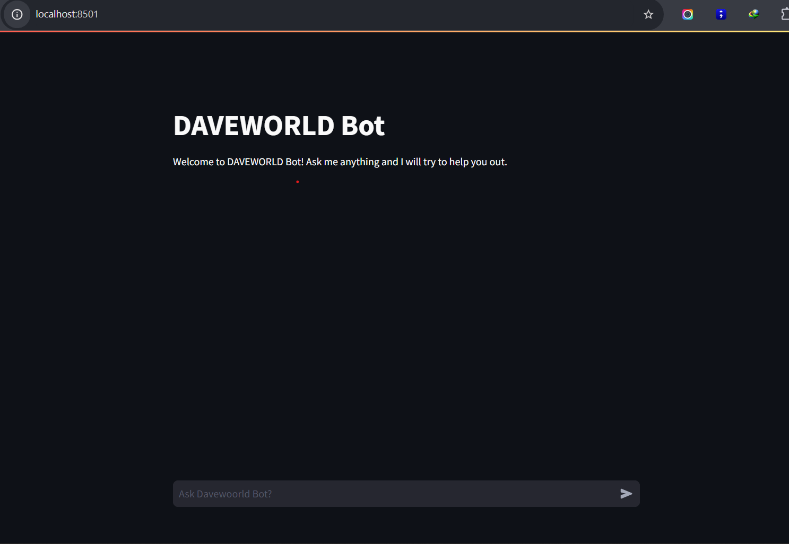

# DAVEWORLD Bot

Welcome to **DAVEWORLD Bot**, a chatbot powered by [Streamlit](https://streamlit.io/) and [Google Generative AI](https://developers.generativeai.google/)!

This bot allows users to ask questions, and it generates relevant responses based on the input. The application demonstrates how to integrate Streamlit with Google Generative AI to build an interactive chatbot.

## Features

- **Interactive Chat UI**: Users can interact with the bot via a web interface built using Streamlit.
- **Generative AI Integration**: Responses are generated using Google Generative AI (gemini-1.5-flash model).
- **Chat History**: The bot maintains the history of chat messages during the session.

## Prerequisites

Make sure you have the following installed:

- Python 3.x
- [Streamlit](https://docs.streamlit.io/library/get-started/installation)
- [Google Generative AI SDK](https://developers.generativeai.google/quickstart)
- [python-dotenv](https://pypi.org/project/python-dotenv/)

## Installation

1. Clone the repository:

   ```bash
   git clone https://github.com/EniolaAdemola/class1-chatbot
   ```

2. Navigate to the project directory:

   ```bash
   cd class1-chatbot
   ```

3. Install the required dependencies:

   ```bash
   pip install -r requirements.txt
   ```

## Setup

1. Create a `.env` file in the root directory of the project to store your Google API key:

   ```bash
   touch .env
   ```

2. Add the following line to your `.env` file:

   ```bash
   GOOGLE_API_KEY=your_google_api_key_here
   ```

   Make sure to replace `your_google_api_key_here` with your actual API key.

## Running the Application

Run the following command to start the Streamlit app:

```bash
streamlit run app.py
```

This will launch the web interface for the chatbot.

## Example of the Bot in Action

Here’s how the user interface looks when running:


Example of the bot responding to a query:


---

### Next Steps:

- Replace the image URLs with the actual URLs of the images once uploaded to GitHub (or another image host).
- Ensure your project follows this structure and the `.env` is correctly set up.

Let me know if there's anything else!

<!-- CONTACT -->

## Contact

Eniola Ademola - [@message me](https://instagram.com/_daveworld) - it.eniolaademola@gmail.com

Github Repo: [EniolaAdemola/class1-chatbot](https://github.com/EniolaAdemola/class1-chatbot)
